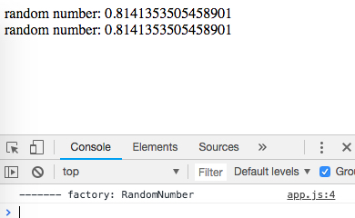

AngularJS1 Factory Singleton Demo
=================================

定义factory的函数只会调用一次。所以就算一个factory被inject到多处，它们拿到的值总是同一个。

```
npm install
open index.html
```



Resources
---------

- AngularJS1: <https://angularjs.org/>
